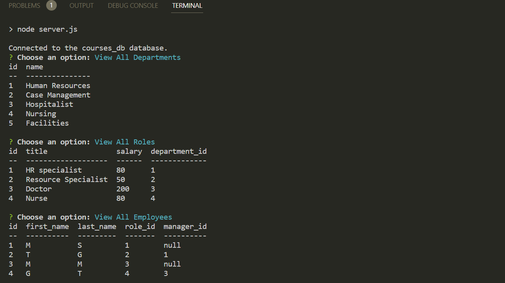
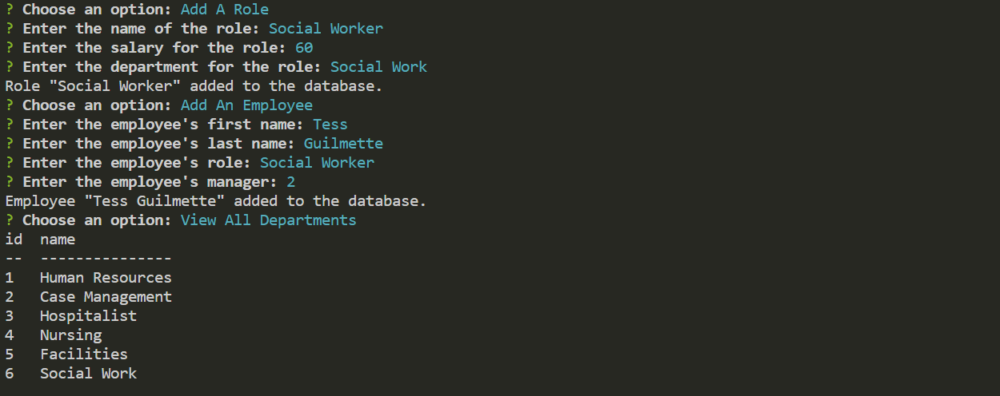

# <Employee-Tracker>

## Description

This application is an employee tracker. The user will go through a set of prompts in the command line to view different tables of information. This app uses MySQL2 and Inquirer to run. 

## Usage

To initiate and use this app the user must ensure that inquirer and MySQL are installed by typing "npm i" in the command line. Then the user will start the application by typing "npm start" in the command line. This will introduce a list of items the user can select depending on what they would like to see or do. The user can view each table including a department table, role table, and employee table. The user can also add departments, roles, or employees to the tables and re-run the application to see the updated data. 

[Walkthrough Video](https://drive.google.com/file/d/1P9ENeO8itsSrf6NvkHJTNvRXj_1LOYrj/view)

